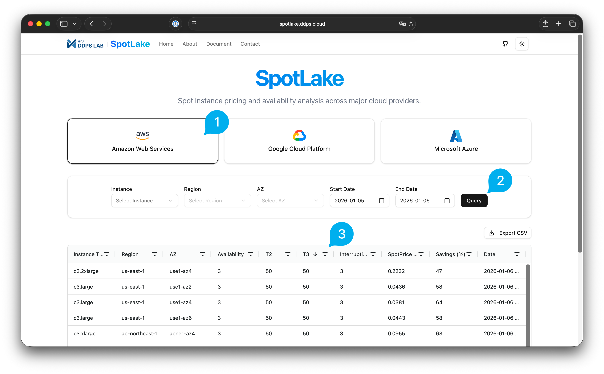

# SpotLake [](https://doi.org/10.5281/zenodo.7084392)

## What is SpotLake System?

SpotLake system is an integrated data archive service that provides spot instance datasets collected from diverse public cloud vendors. The datasets include various information about spot instances like spot availability, spot interruption frequency, and spot price. Researchers and developers can utilize the SpotLake system to make their own system more cost-efficiently. 

SpotLake system currently provides the latest and restricted range of spot datasets collected from **AWS**, **Google Cloud**, and **Azure** through a demo page. We believe numerous systems could achieve a huge improvement in cost efficiency by utilizing the SpotLake system.

## Project Structure

```
.
├── collector/              # Data collection modules
│   ├── instance-specs/     # Hardware specifications measurement
│   │   ├── aws/           # AWS instance specs collector
│   │   ├── azure/         # Azure instance specs collector
│   │   └── gcp/           # GCP instance specs collector
│   └── spot-dataset/       # Spot instance stability data collection
│       ├── aws/           # AWS spot data collectors
│       │   ├── batch/     # AWS Batch implementation
│       │   ├── ec2/       # EC2-based collectors
│       │   └── lambda/    # Lambda-based collectors
│       ├── azure/         # Azure spot data collectors
│       │   ├── batch/     # Azure Batch implementation
│       │   ├── ec2/       # EC2-based collectors
│       │   └── lambda/    # Lambda-based collectors
│       └── gcp/           # GCP spot data collectors
│           ├── ec2/       # EC2-based collectors
│           └── lambda/    # Lambda-based collectors
├── frontend/              # Web application (Next.js)
│   ├── public/            # Static assets
│   │   └── images/       # Images including howto.png
│   └── src/               # Source code
│       ├── app/           # Next.js app router pages
│       └── components/    # React components
├── preprocessing/         # Data preprocessing scripts
└── utility/              # Utility tools and helpers
```

## Demo Web Application

The SpotLake demo web application is available at:

**https://spotlake.ddps.cloud/**

### How To Use Demo-Web



1. **Vendor selection**
   
   On the demo page, users can select one cloud vendor among AWS, Google Cloud, or Azure to show the latest spot instance dataset in the table below. The table shows the latest dataset of the selected cloud vendor, and it contains every pair of instance types and regions provided by the vendor.

2. **Querying**
   
   Since the default table shows only the latest dataset of every instance-region pair, users have to query with specific Instance Type, Region, AZ, and Date Range options to get the historical dataset. Data query has some limitations; the maximum number of the returned data point is 20,000 and user can set the date range up to 1 month. If user selects the 'ALL' option in Region or AZ field, the returned dataset contains every Regions or AZs corresponding to the Instance Type option.
   
   Even if user send query with specific date range, SpotLake does not return data points in the date range. SpotLake system only saves the data point when there is a change in any fields. Therefore, user only get the changed data points with demo page's querying feature. If you want to get the full dataset, check the 'How to access full dataset' section on about page.

3. **Filtering**
   
   User can apply additional filter to the table that shows default latest dataset or queried dataset. For instance, user can select specific data points that contains specific character in Instance Type column or filter by size of the score. Also table could be exported in the CSV format with EXPORT button.

## Research Paper

If you are interested in an analysis of the SpotLake datasets or system implementation, check the latest version of the SpotLake paper which is published in IISWC 2022.

- **Paper**: [spotlake-ieee-official.pdf](https://github.com/ddps-lab/spotlake/files/9962402/879800a242.pdf)
- **IEEE Xplore**: https://ieeexplore.ieee.org/document/9975369

After the initial SpotLake publication, we have been actively conducting various follow-up research based on the SpotLake datasets and system:

- **Public Spot Instance Dataset Archive Service (WWW 2023)**  
  [ACM DL](https://dl.acm.org/doi/10.1145/3543873.3587314)

- **Making Cloud Spot Instance Interruption Events Visible (WWW 2024)**  
  [ACM DL](https://dl.acm.org/doi/10.1145/3589334.3645548)

- **Multi-Node Spot Instances Availability Score Collection System (HPDC 2025)**  
  [ACM DL](https://dl.acm.org/doi/abs/10.1145/3731545.3735122)

## How to Access Full Dataset

We can not provide the full dataset through this web-service because the dataset is too large. Those who want to access the full dataset of the SpotLake system, please fill out the google form below and we will give you access permission for the full dataset.

**Request Form**: https://forms.gle/zUAqmJ4B9fuaUhE89
